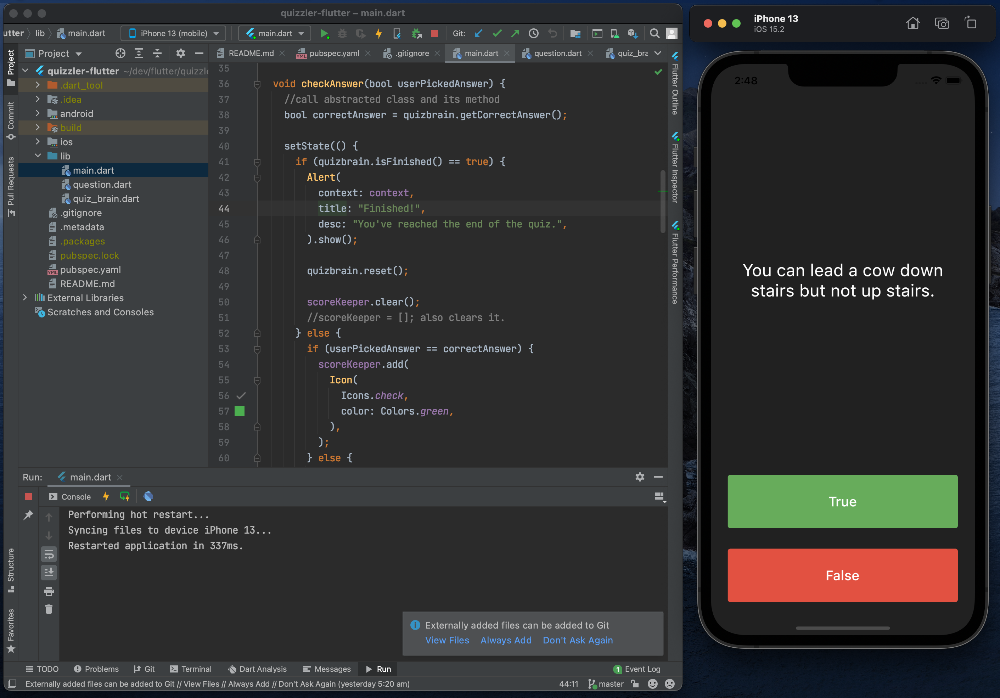

# Quizzler ❓

A quiz app that tests your general knowledge.

## App screenshot

## Lessons learnt
App built from Complete Flutter Development Bootcamp. Learnt the following by building Quizzler app:
- Object Oriented Programming (OOP)
- Modularising your code into separate classes.
- Dart classes and objects.
- Using class constructors.
- Extracting Widgets to refactor your code.
- private and public modifiers in Dart.
- How to use Dart lists.
- The difference between var, const and final.
